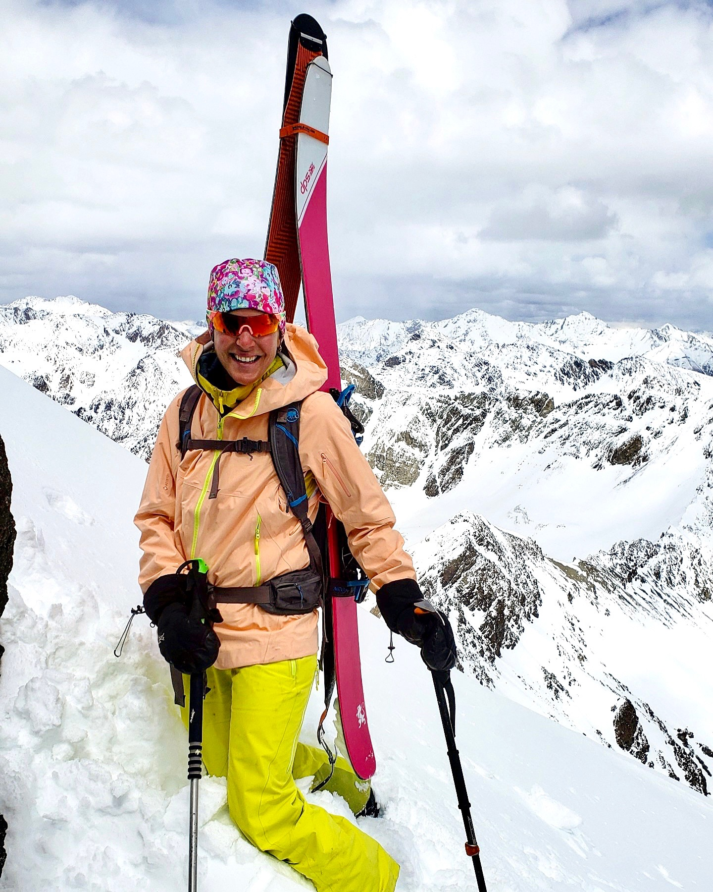

::: {.about-section}

## What We Believe

No fluff.  
No paid placements.  
No fake “top 10” lists.

Just honest experiences and thoughtful travel.

## Hi, I’m Betsy

The voice behind The Thoughtful Traveler — chasing wild places and calling out what’s real.

{width=100%}

*Traveling with intention, not just for the destination.*

I love to travel.

Not just to see new places, but to understand them — how they work, who they support, and what impact tourism actually has once you’re there.

Over time, I started noticing something.

A lot of places call themselves “eco-friendly” or “sustainable,” but those labels don’t always mean much. Some places are doing incredible work behind the scenes. Others are mostly marketing.

This site started as a way to figure out the difference.

------------------------------------------------------------------------

## How I Travel

I’m a backpacker, a skier, and someone who feels most at home outside — which is exactly why I’m not drawn to over-the-top luxury.

I care about:
- staying somewhere that feels intentional
- good service and thoughtful design
- experiences like hiking, diving, and exploring
- and whether a place is actually doing things the right way

I’ll spend more for a better experience — but only when it actually earns it.

------------------------------------------------------------------------

## What This Site Is

The Thoughtful Traveler is part travel journal, part sustainability review.

I stay in places, experience them fully, and then break them down:

-   what they do well\
-   where they fall short\
-   and whether their sustainability claims actually hold up

Some places will impress me.

Some won’t.

Either way, I’ll tell you honestly.

------------------------------------------------------------------------

## Why It Matters

Travel has impact — on the environment, on local communities, and on the places we love to visit.

If we’re going to keep exploring the world, it makes sense to be more intentional about how we do it.

This site isn’t about being perfect.

It’s about paying attention.

------------------------------------------------------------------------

## Outside of Travel

When I’m not traveling, I’m usually at home in Idaho — hiking, skiing, or just enjoying being outside.

That balance matters.

Because travel isn’t just about going somewhere new — it’s about coming back with a different perspective.

------------------------------------------------------------------------

## One Simple Goal

Help people find better places to stay.

And give credit to the ones doing it right.

---

*Stay curious. Travel thoughtfully.*
:::
