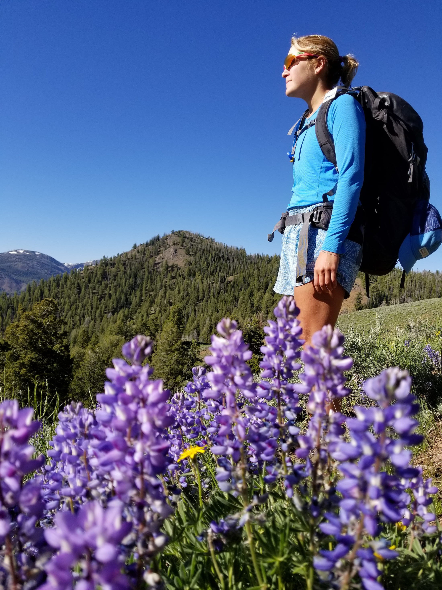
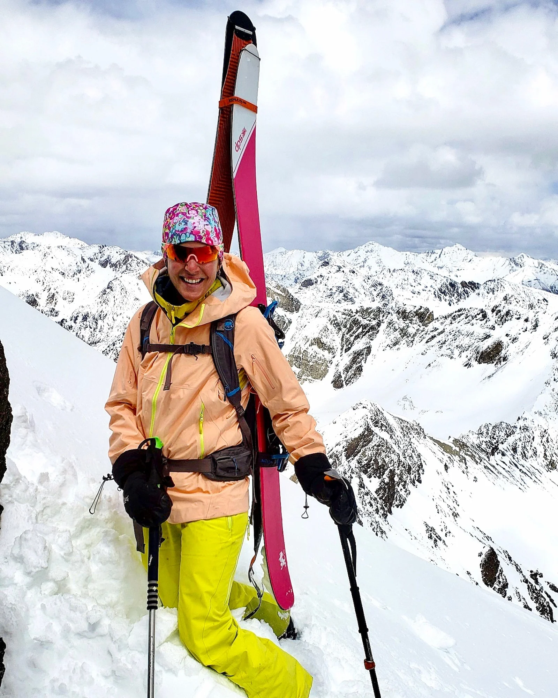
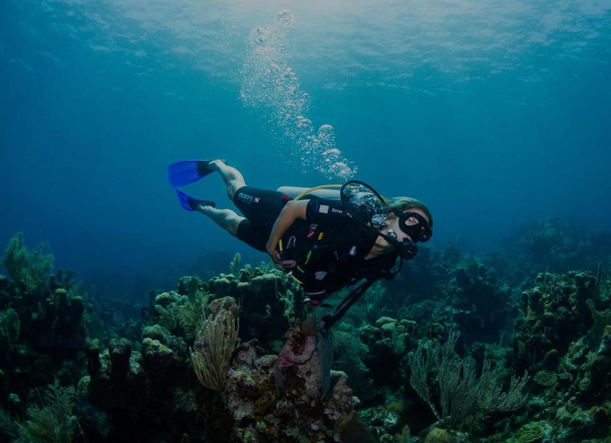
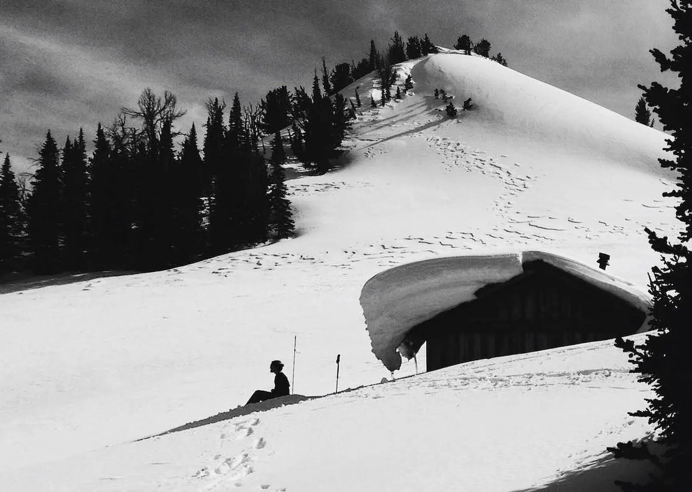

::: {.about-hero-image}

::: {.about-hero-text}
# The Traveler Behind This

Beautiful places. Honest experiences. No fluff.
:::

::: {.about-section}

## What This Is

No paid placements.  
No fake “top 10” lists.  
No pretending every luxury resort is sustainable because it replaced plastic straws with bamboo ones.

Working in sustainability made me more skeptical, not less.

I learned that good intentions and good marketing are not always the same thing. Some places are doing incredible work behind the scenes. Others are mostly selling a feeling.

The No Fluff Traveler grew out of that tension.

Just honest experiences, thoughtful travel, and a closer look at what places are actually doing behind the marketing.

------------------------------------------------------------------------

## Hi, I’m Betsy

The person behind The No Fluff Traveler.

I’ve spent the last 15 years working around sustainability, conservation, tourism, and outdoor recreation — from environmental policy work and nonprofit advocacy to sustainability leadership within the travel industry itself.

Over time, that background changed the way I travel.

I started noticing how often sustainability was being used as branding instead of something measurable, operational, and real.

{width=100%}

*Traveling with intention — not just for the destination.*

I’ve always been drawn to places that feel connected to the landscape around them.

Mountain towns. Remote islands. Backcountry huts. Small hotels with character. Places that still feel real.

Over time, I started noticing something:

A lot of destinations market themselves as “eco-friendly” or “sustainable,” but those labels don’t always mean much once you look closer.

Some places are doing incredible work behind the scenes.

Others are mostly good branding.

This site started as a way to figure out the difference.

------------------------------------------------------------------------

## How I Travel

Most of my favorite trips still involve being outside — skiing, diving, hiking, backpacking, or exploring remote places that remind you how important conservation actually is.

I’m a backpacker, skier, diver, and someone who feels most at home outside.

I care about beautiful places, but I also care about:
- whether tourism actually benefits the local community
- whether sustainability claims hold up in practice
- thoughtful design and good service
- experiences that feel connected to place instead of manufactured for Instagram

I’m not anti-luxury.

I just think luxury should actually earn its footprint.

::: {.diving-photo-wrapper}

{.about-inline-image}

::: {.diving-caption}
Some of the places worth protecting are underwater.
:::

:::

------------------------------------------------------------------------

## Where This Perspective Comes From

Before starting The No Fluff Traveler, I worked in environmental and sustainability roles connected to tourism, conservation, public lands, and outdoor recreation.

That experience has included:
- sustainability work within the ski and hospitality industry
- nonprofit conservation and environmental advocacy
- public land and community planning work
- outdoor education and stewardship
- conservation-focused volunteer work
- and years spent traveling, diving, skiing, backpacking, and exploring wild places firsthand

Those experiences shape how I evaluate destinations now — not just as a traveler, but as someone who understands how tourism impacts the places behind the experience.

## What We Look For

The No Fluff Traveler reviews places through a wider lens than most travel sites.

We look at:
- the overall experience
- environmental impact
- local employment and community investment
- food sourcing and waste
- conservation efforts
- transparency
- and whether sustainability feels operational or purely marketing-driven

Some places genuinely impress us.

Some are mostly good marketing.

Either way, we’ll tell you honestly.

------------------------------------------------------------------------

## Why This Matters

Travel has impact.

On landscapes. On local economies. On culture. On the people who live there long after visitors leave.

And while no form of travel is perfectly sustainable, some places are clearly making a real effort to do things better.

Those are the places worth highlighting.

::: {.hut-photo-wrapper}

{.hut-inline-image}

::: {.hut-caption}
The more time you spend outside, the harder it becomes to ignore what tourism gets right — and what it gets wrong.
:::

:::

Not because they’re perfect — but because they’re trying in ways that are measurable, visible, and meaningful.

------------------------------------------------------------------------

## Outside of Travel

When I’m not traveling, I’m usually back home in Idaho — skiing, hiking, biking, or finding excuses to spend time outside.

That balance matters.

Because the more time you spend connected to a place, the more you notice when other places are protecting what makes them special — or slowly losing it.

------------------------------------------------------------------------

## One Simple Goal

Help people find places worth supporting.

And give credit to the ones actually doing it right.

---

*Stay curious. Travel thoughtfully.*

:::