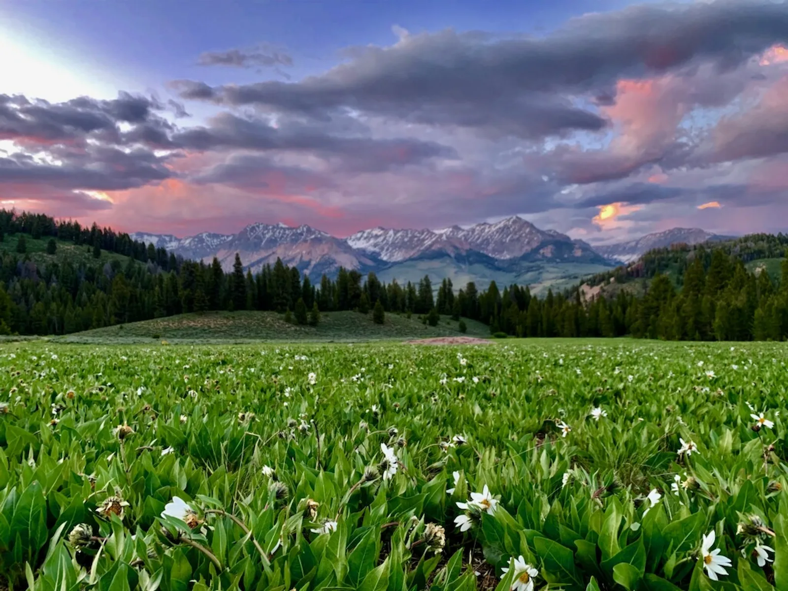
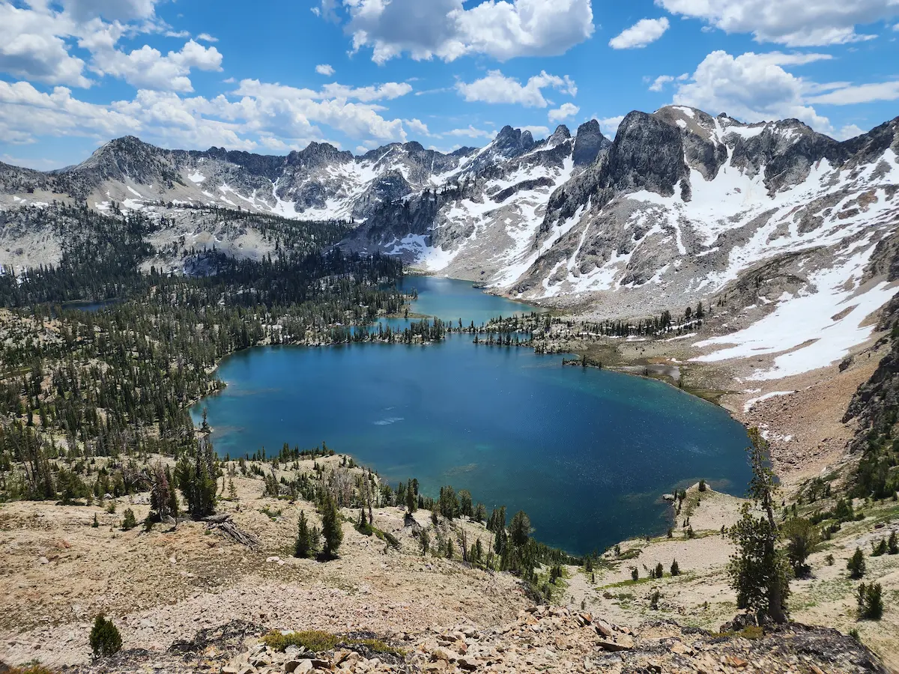
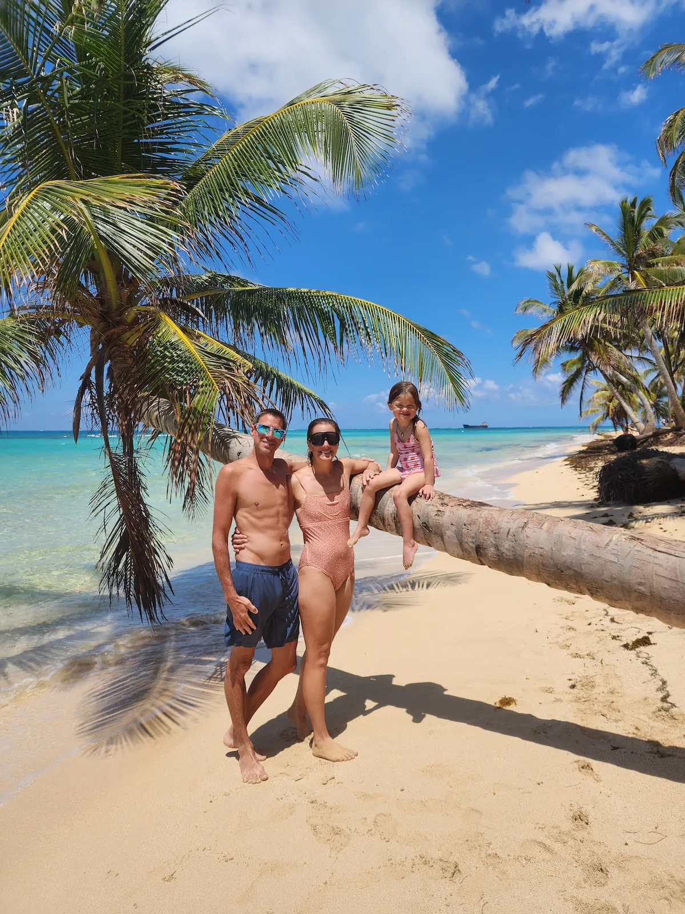
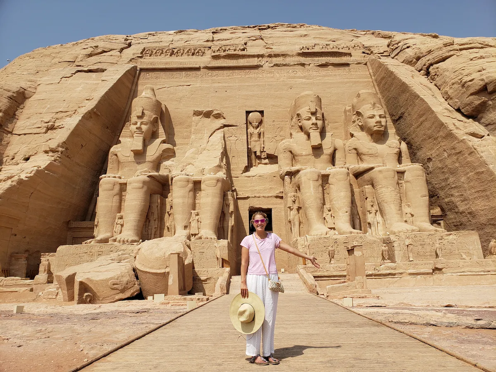
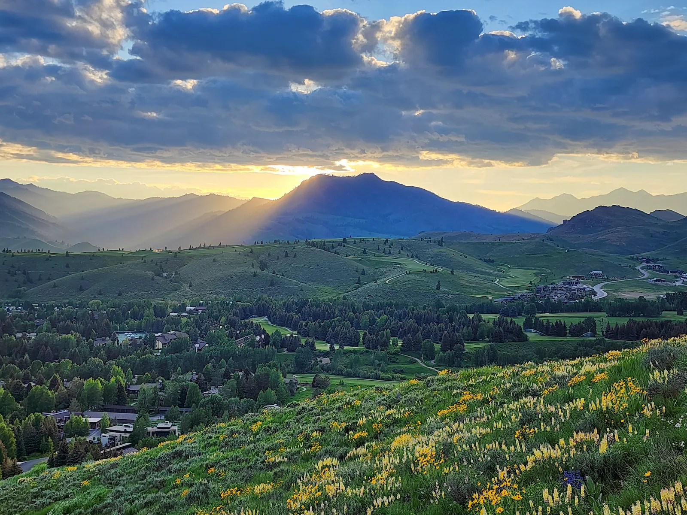

::::: hero
::: hero-title
# The No Fluff Traveler
:::

::: hero-bottom
### Thoughtful travel. No fluff.

Beautiful places, honest reviews, and real experiences —
from backcountry huts to eco resorts that actually walk the talk.

#notsponsored
:::
:::::

:::::::::::::::::::::::: section-soft
## Beautiful places. Honest reviews.

The No Fluff Traveler exists for people who want more than curated marketing and recycled travel lists.

Some places are genuinely special.

Some are mostly good photography and better branding.

We look beyond the surface — at the experience, the atmosphere, the people, the environmental impact, and whether a place actually follows through on what it claims to be.

Because beautiful travel is easy to sell.

Thoughtful travel is harder to prove.

::: section-green
## Start Here

If you are new here, start with the idea behind the site:

**Beautiful travel is easy to market. Thoughtful travel is harder to prove.**

We look at the full picture — the stay, the service, the setting, the sustainability claims, and whether the place actually protects what makes it special.
:::

{.full-image}

:::::::::: section-green
## What We Cover

::::::::: columns
:::: {.column width="33%"}
::: card

### Adventure

Remote places, wild landscapes, and the activities that make travel feel alive.
:::
::::

:::: {.column width="33%"}
::: card

### Family Travel

Beautiful places that still work when real life, kids, logistics, and budgets come along.
:::
::::

:::: {.column width="33%"}
::: card

### Global Perspective

From eco resorts to cultural destinations, we look at how travel impacts people and place.
:::
::::
:::::::::
::::::::::

::: section-soft
## Featured Review

### Misool Eco Resort

**Raja Ampat, Indonesia**

Misool is one of the few luxury eco resorts that genuinely backs up its sustainability claims with measurable conservation and local impact. From solar power and marine conservation to reef restoration and local community employment, it shows what an eco resort can look like when sustainability is built into the operation — not just added to the marketing.

[Read the Misool review](posts/misool.qmd)
:::

:::::: section-green
## What We Look For

::::: columns
::: column
### Energy

How the property powers itself and reduces fossil fuel use.

### Water

How water is sourced, treated, conserved, and managed.

### Food

Whether meals are local, seasonal, sustainable, and low-waste.
:::

::: column
### Local Impact

Whether the stay supports nearby communities with jobs, training, and long-term benefit.

### Conservation

Whether the property protects or restores the environment around it.

### Transparency

Whether sustainability claims are clear, measurable, and easy to verify.
:::
:::::
::::::

{.full-image}

Travel starts close to home — and it changes how you see everywhere else.

:::::::: section-soft
## Latest Reviews

::::::: columns
:::: column
::: card
### Misool Eco Resort

**Raja Ampat, Indonesia**

A remote island resort proving that luxury, conservation, and community impact can work together.

[Read more](posts/misool.qmd)
:::
::::

:::: column
::: card
### Morgan’s Rock Eco Resort

**Nicaragua**

A beautiful stay with promising sustainability claims — and a review still in progress.

[Coming soon](posts/morgans-rock.qmd)
:::
::::
:::::::
::::::::

::: section-green
## Our Approach

We do not take sustainability claims at face value.

We stay, experience, ask questions, look for proof, and tell you what feels real.

A beautiful hotel is one thing.

**A beautiful hotel that protects the place it depends on is something else.**

Stay curious. Travel thoughtfully.

:::
::::::::::::::::::::::::
