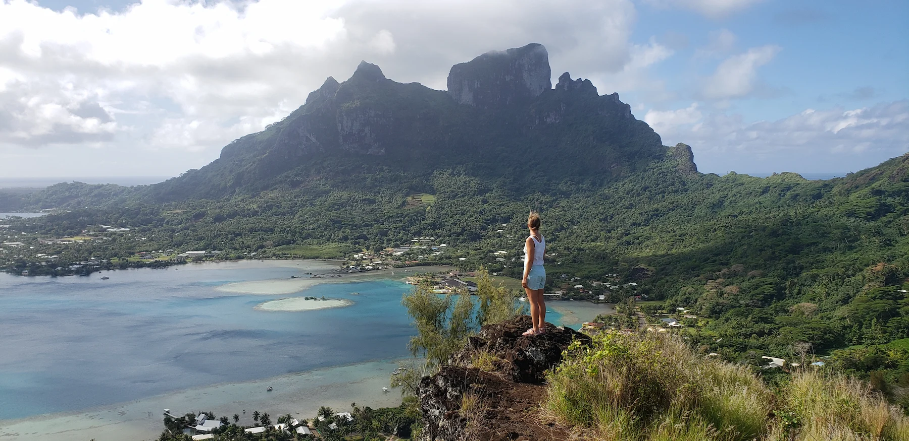

{.post-hero-image}

::: {.about-section}

## Luxury Should Earn Its Footprint

I love remote huts.

I love ski cabins with questionable insulation, camp coffee before sunrise, sleeping in a tent after a long approach, and waking up to frozen boots outside the door.

But I also love a really good hotel.

A place with thoughtful design. Incredible food. Warm lighting. Crisp sheets. Good coffee. Quiet rooms. A bed you actually want to sleep in.

And yes — down pillows that somehow make you reconsider every pillow you own at home.

Luxury itself is not the problem.

The question is whether that luxury comes at the expense of the place people traveled there to experience.

---

## The Tradeoff Nobody Talks About

Remote luxury is resource intensive.

Especially in places where everything has to be flown in, shipped in, desalinated, generated, maintained, refrigerated, or removed afterward.

That reality does not disappear because a resort uses words like “eco,” “green,” or “sustainable.”

And honestly, I think travelers are becoming more aware of that.

People want beautiful experiences.

But they also want to feel like the place they are supporting is doing more than the bare minimum.

---

## What Thoughtful Luxury Looks Like

The best luxury properties understand something important:

The landscape is not just scenery.

It is the entire reason people came.

That changes how a place operates.

You start noticing things:

* renewable energy systems that are actually substantial
* water conservation that goes beyond asking guests to reuse towels
* food sourcing connected to the local environment
* long-term investment in nearby communities
* conservation efforts that are measurable and visible
* buildings designed around the landscape instead of imposed on it

The details matter.

Not because perfection exists.

But because effort becomes visible.

---

## Comfort And Conservation Can Coexist

I do not think sustainability means discomfort.

I do not think travelers need to feel guilty for enjoying beautiful places, thoughtful hospitality, or exceptional experiences.

Some of the most memorable places I have stayed were both deeply comfortable and deeply connected to the environment around them.

The problem is not luxury itself.

The problem is luxury without responsibility.

---

## The Difference Between Experience And Extraction

A place earns its footprint when it gives something back to the landscape, ecosystem, or community that supports it.

That does not always look dramatic.

Sometimes it is local hiring.
Sometimes it is reef restoration.
Sometimes it is limiting growth.
Sometimes it is protecting land that would otherwise be developed.

Sometimes it is simply operating with restraint.

The places worth supporting usually understand that long-term stewardship matters more than short-term marketing.

---

## Why This Matters

Travel is emotional.

People remember how places make them feel.

But eventually, the feeling alone is not enough.

The older I get, the more I care about what exists behind the experience:

Who benefits from tourism.
Who absorbs the impact.
Who protects the place once the guests leave.

That does not make me love beautiful hotels any less.

If anything, it makes me appreciate the good ones more.

Because when luxury and stewardship actually align, you can feel the difference.

---

## The No Fluff Take

I will probably always love both ends of the spectrum.

Backcountry huts.
Remote camps.
Simple cabins.
And incredibly thoughtful luxury properties.

But the places that stay with me most are usually the ones where the experience feels connected to something bigger than comfort alone.

Luxury should not just look beautiful.

It should respect the reason the place was worth visiting in the first place.

:::
