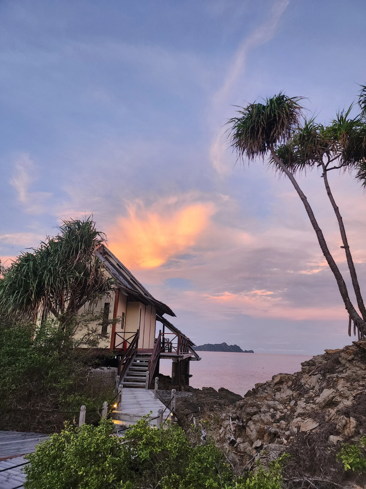
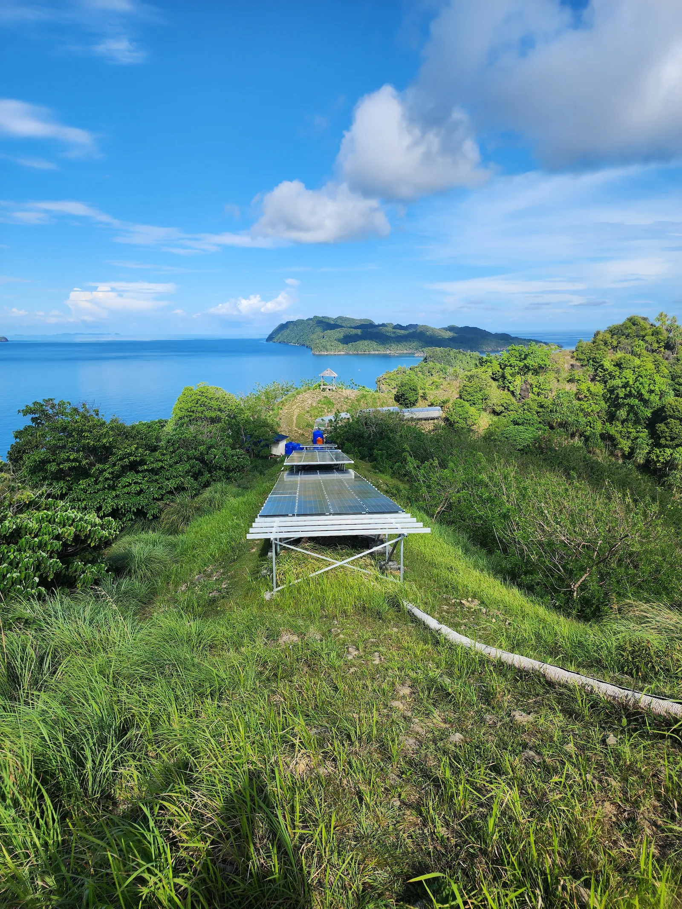
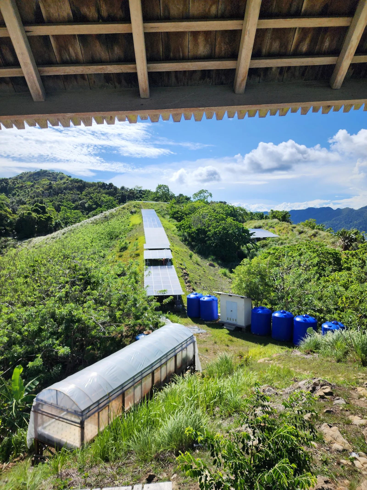
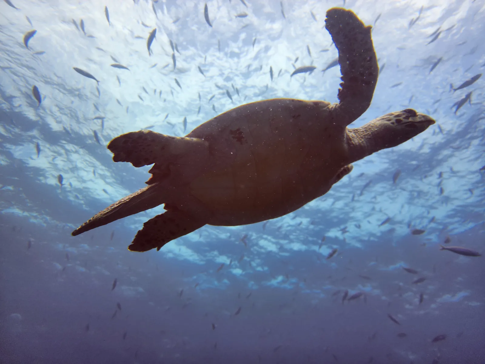
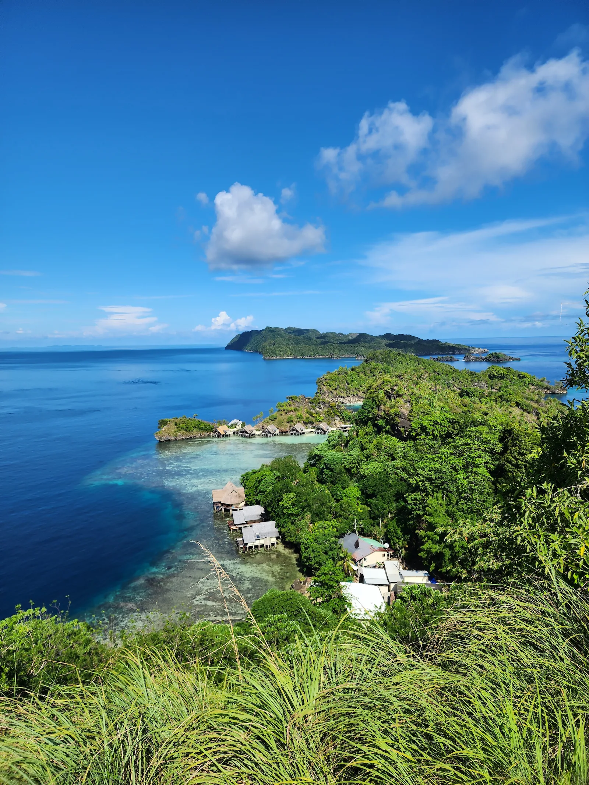

{width=100%}

::: {.section-green}

## Review Details

| Category | Details |
|---|---|
| Location | Raja Ampat, Indonesia |
| Style | Remote Luxury Eco Resort |
| Best For | Divers, couples, conservation-focused travelers |
| Trip Type | Bucket-list / Adventure Luxury |
| Sustainability Focus | Marine conservation, renewable energy, local employment |
| Vibe | Quiet, remote, intentional |
| Price Range | $$$$ |
| Worth the Hype? | Absolutely |

### What Stands Out
- Massive marine conservation impact
- Thoughtful low-impact luxury
- Incredible diving and biodiversity
- Strong connection to local communities


## The Experience

Misool feels less like a resort built in nature and more like a resort built around protecting it.

From the moment you arrive, it’s clear this isn’t just a luxury destination — it’s built around protecting the environment it sits in. The setting is unreal: remote, untouched, and intentionally preserved.

The remoteness is part of what makes Misool special, but it also means getting there takes real effort, time, and expense. This isn’t the kind of trip you casually add onto a vacation itinerary.

The experience feels high-end without being disconnected from the place itself. Everything — from the design of the villas to the daily operations — feels integrated into the natural surroundings rather than imposed on them.

It’s easily one of the most impressive places we’ve ever stayed.

{width=100%}

------------------------------------------------------------------------

## Sustainability Breakdown

### Energy

{width=100%}

**What We Noticed:**  
Misool operates on a large solar array that powers the majority of the island. For a resort this remote and high-end, the investment in reducing diesel dependence is substantial.

**Why It Matters:**  
Remote luxury resorts often rely heavily on fuel shipments and diesel generators. Large-scale solar infrastructure dramatically reduces operational emissions and environmental impact.

**No Fluff Takeaway:**  
This feels like a genuine operational commitment, not a sustainability feature added later for marketing.

------------------------------------------------------------------------

### Water

{width=100%}

**What We Noticed:**  
Freshwater is carefully sourced, treated, and managed on-site. Water use throughout the resort feels intentional rather than excessive.

**Why It Matters:**  
Freshwater management is one of the biggest sustainability challenges for remote island resorts, especially in fragile marine environments.

**No Fluff Takeaway:**  
Nothing about the experience felt wasteful or disconnected from the realities of the location.

------------------------------------------------------------------------

### Food

{width=100%}

**What We Noticed:**  
Meals are built around locally sourced and sustainable ingredients with an emphasis on seasonal menus and low-waste operations.

**Why It Matters:**  
Import-heavy luxury tourism can create massive environmental costs for remote destinations. Thoughtful sourcing reduces waste, shipping impact, and dependence on outside supply chains.

**No Fluff Takeaway:**  
The food program feels aligned with the environment instead of competing against it.

------------------------------------------------------------------------

### Local Impact

{width=100%}

**What We Noticed:**  
Misool actively employs people from nearby communities and supports alternatives to destructive industries like shark finning.

**Why It Matters:**  
Conservation efforts rarely succeed long term without local economic investment and community support.

**No Fluff Takeaway:**  
This is where Misool separates itself from many luxury eco resorts. The local impact feels measurable and deeply integrated into the operation.

------------------------------------------------------------------------

### Conservation

{width=100%}

**What We Noticed:**  
Misool helped establish and actively patrol a 300,000-acre marine reserve where reef health, fish populations, and shark numbers have rebounded dramatically.

**Why It Matters:**  
A lot of resorts market conservation. Very few operate at this scale with visible, long-term ecological results.

**No Fluff Takeaway:**  
This goes far beyond sustainability branding. The conservation work is measurable, ongoing, and central to the identity of the resort itself.

------------------------------------------------------------------------

### Transparency

**What We Noticed:**  
Misool openly communicates its conservation efforts, operational challenges, and sustainability initiatives throughout the guest experience.

**Why It Matters:**  
Transparency is often the difference between real sustainability work and carefully curated marketing language.

**No Fluff Takeaway:**  
The resort consistently backs up its claims with visible action, data, and long-term investment.

------------------------------------------------------------------------

{width=100%}

## Scorecard

Unlike many resorts that rely on sustainability branding, Misool backs its claims with long-term conservation data and community investment.

```{r, echo=FALSE, message=FALSE}
library(tidyverse)

misool <- tibble(
  category = c("Energy", "Water", "Food", "Local Impact", "Conservation", "Transparency"),
  score = c(9, 9, 9, 10, 10, 9)
)

ggplot(misool, aes(x = reorder(category, score), y = score)) +
  geom_col() +
  coord_flip() +
  labs(
    title = "Sustainability Scorecard",
    x = "",
    y = "Score (out of 10)"
  )
```

------------------------------------------------------------------------
::: {.section-soft}

## The No Fluff Take

Misool is one of the rare eco resorts where the sustainability work feels deeply integrated into the entire experience rather than added as branding afterward.

The luxury is real.
The conservation impact appears measurable.
And the local community connection feels meaningful instead of performative.

It’s expensive and difficult to reach — but unlike many luxury eco destinations, Misool actually earns its reputation.

:::

## Final Verdict

Misool is one of the rare luxury eco resorts where the sustainability work feels deeply integrated into the entire operation instead of added for branding purposes later.

The conservation effort is measurable.
The community impact feels real.
And the experience itself still delivers at a world-class level.

It’s expensive.
It’s remote.
And getting there takes commitment.

But unlike many high-end “eco” destinations, Misool actually earns the label.

#notsponsored