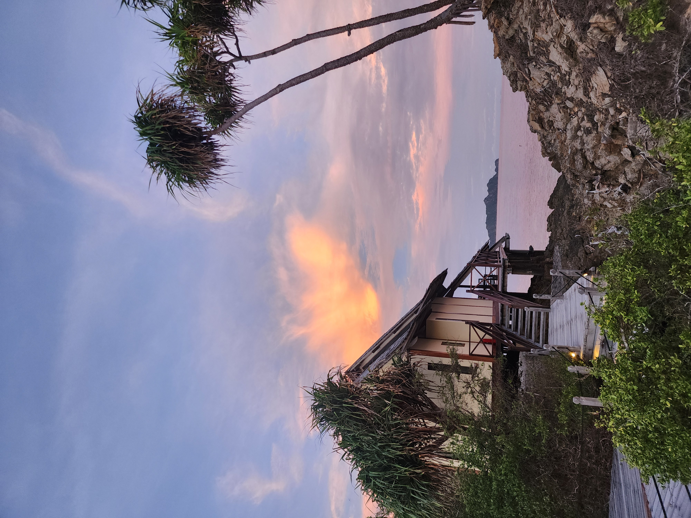
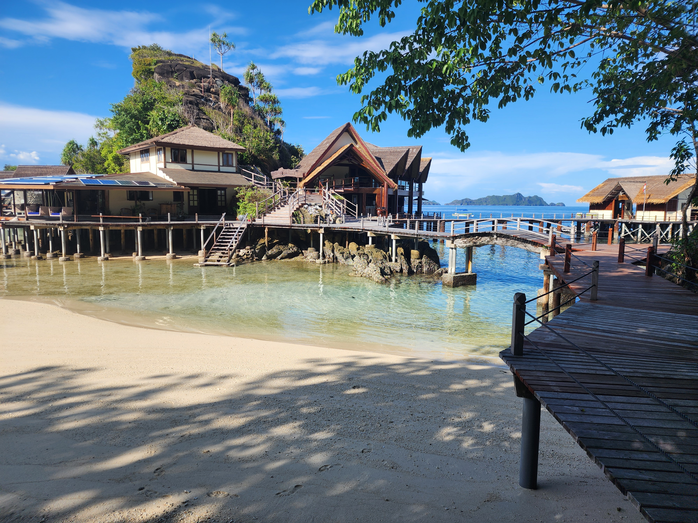
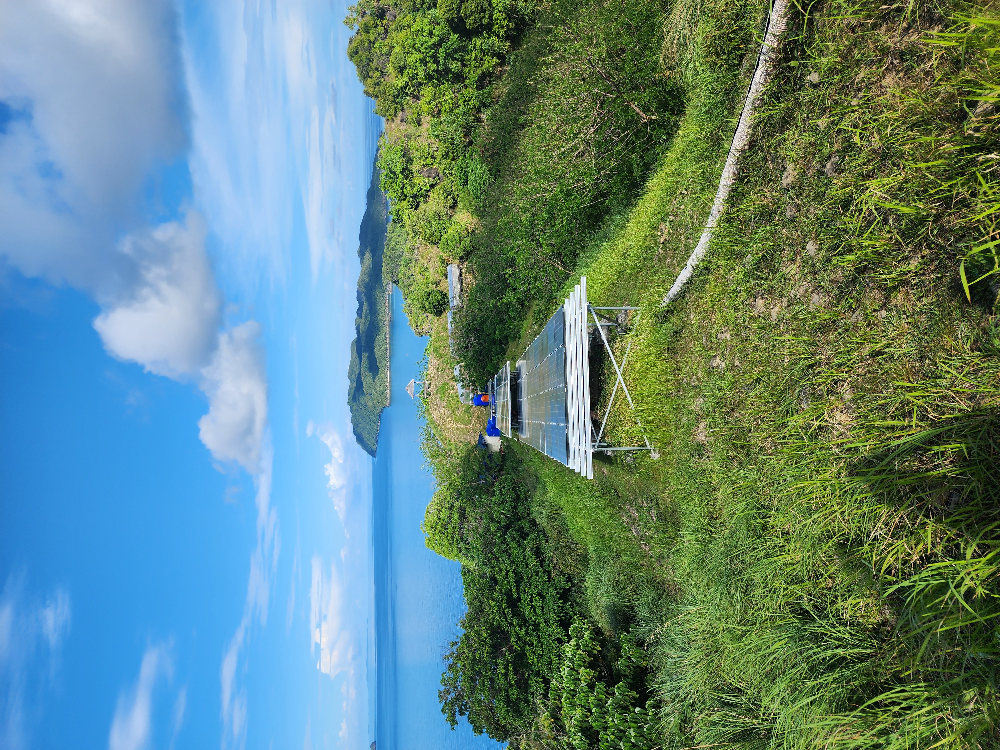
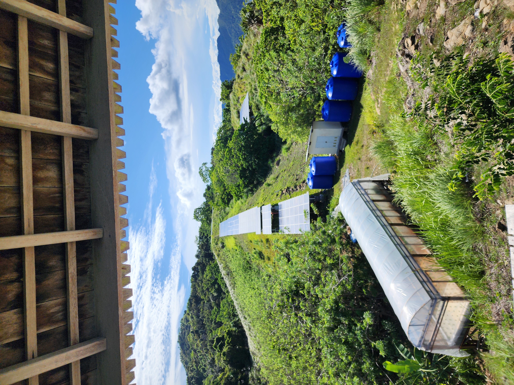
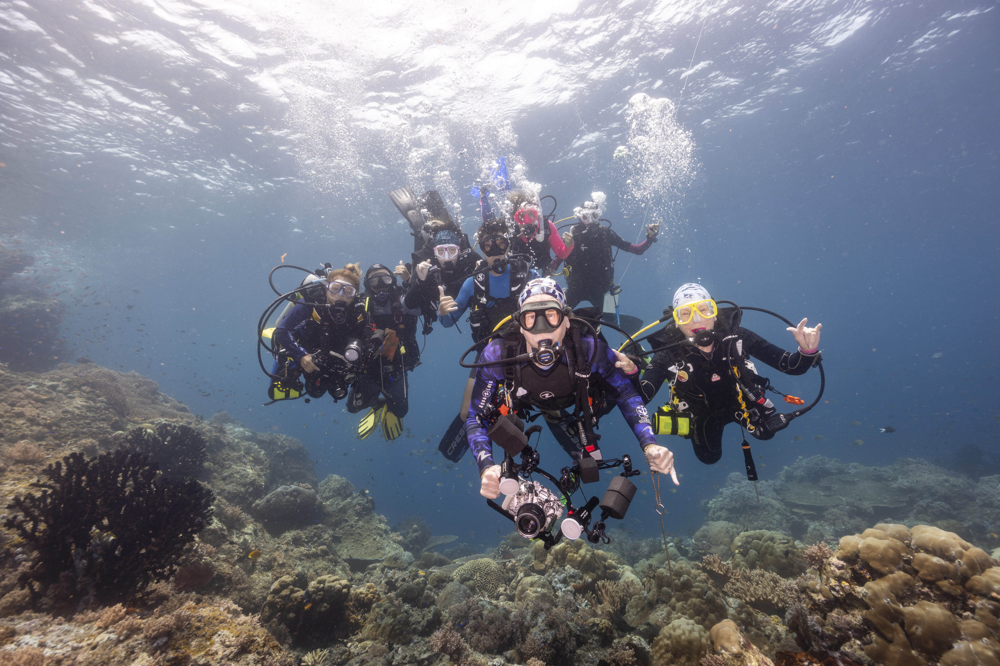
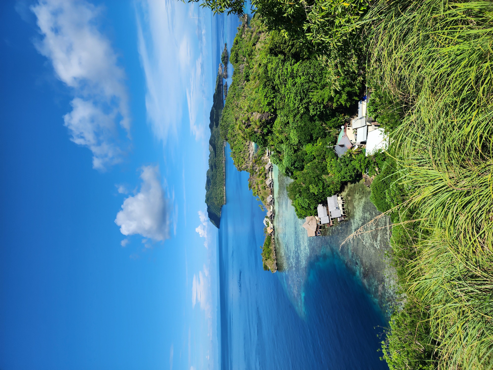

{width=100%}

## The Experience

Misool is one of those places that immediately feels different.

From the moment you arrive, it’s clear this isn’t just a luxury destination — it’s built around protecting the environment it sits in. The setting is unreal: remote, untouched, and intentionally preserved.

The experience feels high-end without being disconnected from the place itself. Everything — from the design of the villas to the daily operations — feels integrated into the natural surroundings rather than imposed on them.

It’s easily one of the most impressive places we’ve ever stayed.

{width=100%}

------------------------------------------------------------------------

## Sustainability Breakdown

### Energy

{width=48%}

Misool operates on a large solar array that powers the majority of the island. You can tell they’ve invested heavily in reducing reliance on fossil fuels, which is rare at this level of luxury and remoteness.

### Water

Freshwater is carefully managed and treated on-site. Given the remote island location, it’s clear water use is intentional and controlled rather than wasteful.

### Food

One of the most impressive parts of the experience.

Meals are built around locally sourced and sustainable ingredients. You’re not seeing excessive imports or waste-heavy menus — it feels thoughtful, seasonal, and aligned with the environment.

{width=48%}

### Local Impact/Experience

{width=100%}

This is where Misool stands out.

They actively employ people from nearby communities and provide an alternative to destructive practices like shark finning. That’s not just sustainability — that’s real impact.

### Conservation

Misool is directly involved in reef restoration and marine conservation. Misool doesn’t just protect reefs—they’ve created and actively patrol a 300,000-acre marine reserve, where fish populations and shark numbers have rebounded dramatically.

This goes far beyond marketing — it’s visible in what they’re doing on the ground.This is what real sustainability looks like—measurable impact, not just messaging.

{width=100%}

### Transparency

They don’t just claim sustainability — they show it.

From conservation efforts to operations, there’s a clear effort to back up what they say with real action.

------------------------------------------------------------------------

{width=100%}

## Scorecard

Unlike many resorts that rely on sustainability branding, Misool backs its claims with long-term conservation data and community investment.

```{r, echo=FALSE, message=FALSE}
library(tidyverse)

misool <- tibble(
  category = c("Energy", "Water", "Food", "Local Impact", "Conservation", "Transparency"),
  score = c(9, 9, 9, 10, 10, 9)
)

ggplot(misool, aes(x = reorder(category, score), y = score)) +
  geom_col() +
  coord_flip() +
  labs(
    title = "Sustainability Scorecard",
    x = "",
    y = "Score (out of 10)"
  )
```

------------------------------------------------------------------------

## Final Thoughts

Misool is one of the few luxury eco resorts that actually backs up its sustainability claims with measurable action.

Worth the hype.

#notsponsored